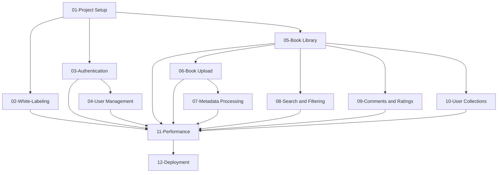

# Sharebrary Tasks Index

This document serves as an index for all development tasks for the Sharebrary project. Tasks are organized in implementation order, with dependencies noted for each task.

## Implementation Sequence

1. **[Project Setup](./01-project-setup.md)**

   - Nx workspace and Next.js setup
   - Firebase project configuration
   - Core UI setup

2. **[White-Labeling Foundation](./02-white-labeling.md)**

   - Configuration structure
   - Theme provider implementation
   - Basic customization capabilities

3. **[Authentication System](./03-authentication.md)**

   - Firebase authentication integration
   - Login/register flows
   - Protected routes
   - User approval system

4. **[User Management](./04-user-management.md)**

   - User profiles
   - Admin dashboard
   - Account settings
   - Role-based permissions

5. **[Book Library Core](./05-book-library.md)**

   - Data models
   - Book card component
   - Library grid view
   - Basic book details page

6. **[Book Upload System](./06-book-upload.md)**

   - File upload interface
   - Storage integration
   - Processing pipeline setup
   - Upload status tracking

7. **[Metadata Processing](./07-metadata-processing.md)**

   - Google Books API integration
   - Gemini AI integration
   - Text extraction from ebooks
   - Background processing with Firebase Functions

8. **[Search and Filtering](./08-search-filtering.md)**

   - Search functionality
   - Category filters
   - Tag-based filtering
   - Combined search and filters

9. **[Comments and Ratings](./09-comments-ratings.md)**

   - Comments system implementation
   - Star rating component
   - Moderation capabilities
   - Rating aggregation

10. **[User Collections](./10-user-collections.md)**

    - Favorites functionality
    - Download history
    - Reading lists (future)
    - Collection management

11. **[Performance Optimization](./11-performance.md)**
    - Image optimization
    - Pagination implementation
    - Data caching strategies
    - Bundle size optimization
12. **[Deployment](./12-deployment.md)**
    - Production environment setup
    - Firebase security rules
    - Monitoring and logging
    - CI/CD pipeline

## Task Dependencies

## Progress Tracking

| Task                 | Status      | Dependencies      | Assigned To | Due Date |
| -------------------- | ----------- | ----------------- | ----------- | -------- |
| Project Setup        | Not Started | None              |             |          |
| White-Labeling       | Not Started | Project Setup     |             |          |
| Authentication       | Not Started | Project Setup     |             |          |
| User Management      | Not Started | Authentication    |             |          |
| Book Library         | Not Started | Project Setup     |             |          |
| Book Upload          | Not Started | Book Library      |             |          |
| Metadata Processing  | Not Started | Book Upload       |             |          |
| Search and Filtering | Not Started | Book Library      |             |          |
| Comments and Ratings | Not Started | Book Library      |             |          |
| User Collections     | Not Started | Book Library      |             |          |
| Performance          | Not Started | All Feature Tasks |             |          |
| Deployment           | Not Started | Performance       |             |          |
